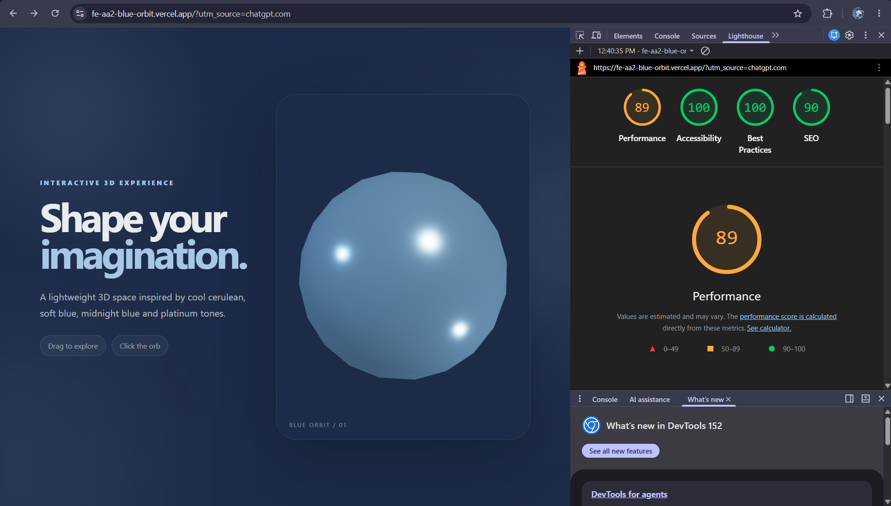
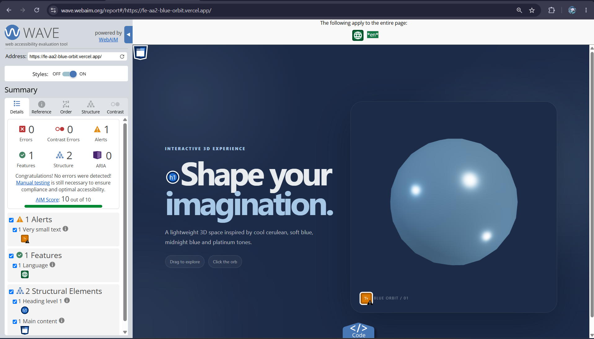
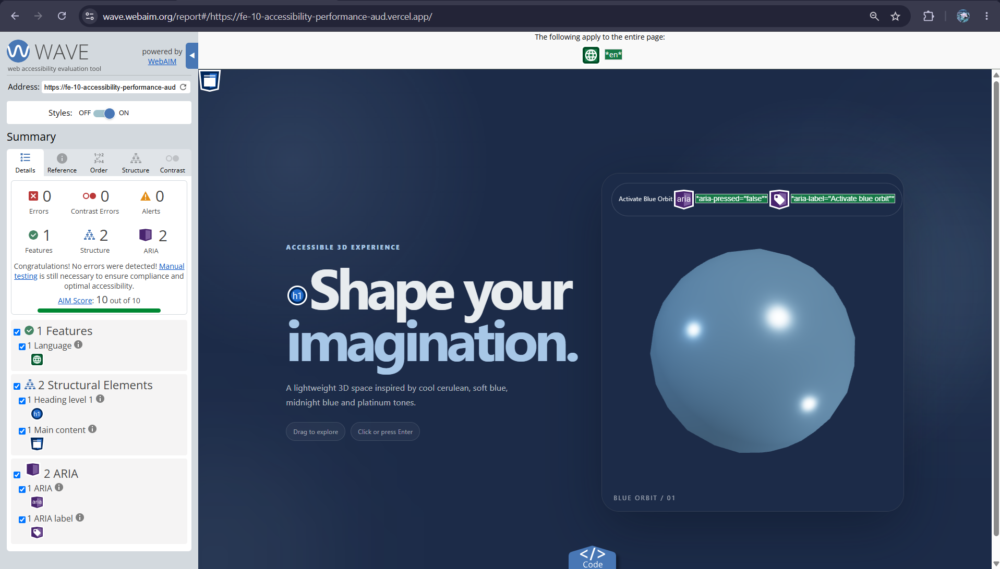
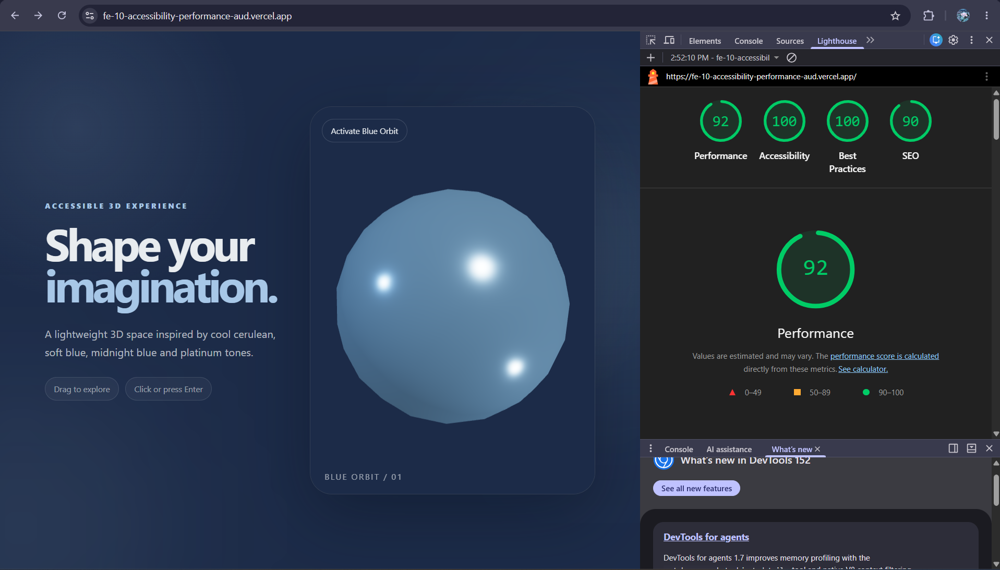

# FE-10 — Accessibility and Performance Audit

**Week 7 · Frontend AI Engineering**

## 1. Overview

This document records the accessibility and performance audit completed for FE-10.

The audit was performed on the deployed FE-10 version of the interactive 3D experience. The process included:

- Lighthouse Mobile audit
- WAVE accessibility audit
- Keyboard-only testing
- Accessibility fixes
- Performance verification
- Manual keyboard verification of the existing FE-06 Streaming AI Chat

The original FE-AA2 project was kept unchanged. FE-10 was created as a separate audit-focused version.

---

## 2. Audit Scope

### Primary Application

**FE-10 — Accessibility and Performance Audit**

Production URL: 🔗 [https://fe-10-accessibility-performance-aud.vercel.app](https://fe-10-accessibility-performance-aud.vercel.app)

### Related AI Chat Application

The FE-10 3D experience does not contain an AI chat interface. Therefore, the existing FE-06 Streaming AI Chat was manually checked for keyboard accessibility as the related AI interface.

Production URL: 🔗 [https://fe-06-streaming-ai-chat-alt0sctly-solo-e5e1.vercel.app](https://fe-06-streaming-ai-chat-alt0sctly-solo-e5e1.vercel.app)

---

## 3. Lighthouse Mobile — Before

The original FE-AA2 deployed experience was audited before the FE-10 accessibility changes.

### Baseline Results

| Category | Score |
|---|---:|
| Performance | **89** |
| Accessibility | **100** |
| Best Practices | **100** |
| SEO | **90** |

### Baseline Screenshot



### Baseline Observation

The original experience already had a Lighthouse Accessibility score of 100.

However, the interactive 3D orb was primarily pointer-based and did not provide a native keyboard-accessible alternative.

---

## 4. WAVE — Before

The original FE-AA2 deployment was also checked with WAVE before the FE-10 changes.

### Baseline Results

| Result | Count |
|---|---:|
| Errors | **0** |
| Contrast Errors | **0** |
| Alerts | **1** |
| Features | **1** |
| Structural Elements | **2** |
| ARIA | **0** |
| AIM Score | **10/10** |

### Baseline Screenshot



### Baseline Finding

WAVE reported one alert related to **very small text**.

The alert was associated with the small scene label used in the 3D experience.

---

## 5. Accessibility Changes

### 5.1 Keyboard-accessible 3D interaction

The original 3D orb interaction used pointer/click interaction.

A native button was added to provide a keyboard-accessible alternative.

The control uses:

- `type="button"`
- descriptive `aria-label`
- `aria-pressed`
- visible focus styling
- keyboard activation

The control can be activated using:

- `Enter`
- `Space`

The accessible button label also changes according to the current state.

**Result**

The primary 3D interaction can now be reached and operated using the keyboard.

---

### 5.2 Visible focus state

A dedicated `:focus-visible` style was added to the keyboard control.

This provides a visible focus indicator when navigating the experience using the keyboard.

---

### 5.3 Small-text improvement

The baseline WAVE audit reported a very-small-text alert for the scene label.

The label was adjusted to improve readability.

**Before**

```css
font-size: .65rem;
```

**After**

```css
font-size: .78rem;
```

The text contrast was also increased.

**Result**

The WAVE alert was eliminated in the after audit.

---

## 6. Keyboard-only Testing

The FE-10 primary interaction was manually tested without using a mouse.

**Test Procedure**

1. Reload the deployed FE-10 page.
2. Navigate using `Tab`.
3. Reach the Activate Blue Orbit button.
4. Activate the control using `Enter`.
5. Activate/deactivate the control using `Space`.
6. Verify the visual state changes.

**Result:** ✅ **PASS**

The primary 3D interaction is keyboard reachable and operable.

---

## 7. WAVE — After

The deployed FE-10 application was rescanned after the accessibility changes.

### After Results

| Result | Count |
|---|---:|
| Errors | **0** |
| Contrast Errors | **0** |
| Alerts | **0** |
| Features | **1** |
| Structural Elements | **2** |
| ARIA | **2** |
| AIM Score | **10/10** |

### After Screenshot



### Measurable Delta

| Metric | Before | After | Change |
|---|---:|---:|---|
| Errors | 0 | 0 | Maintained |
| Contrast Errors | 0 | 0 | Maintained |
| Alerts | 1 | 0 | -1 |
| AIM Score | 10/10 | 10/10 | Maintained |

### WAVE Outcome

The final FE-10 audit produced:

- 0 Errors
- 0 Contrast Errors
- 0 Alerts
- 10/10 AIM Score

---

## 8. Lighthouse Mobile — After

The deployed FE-10 application was audited using Lighthouse in Mobile mode after the changes.

### After Results

| Category | Before | After | Change |
|---|---:|---:|---|
| Performance | 89 | 92 | +3 |
| Accessibility | 100 | 100 | Maintained |
| Best Practices | 100 | 100 | Maintained |
| SEO | 90 | 90 | Maintained |

### After Screenshot



### Final Target Check

The assignment target was 90+ for both Performance and Accessibility.

| Target | Final Result | Status |
|---|---:|---|
| Performance 90+ | 92 | ✅ Passed |
| Accessibility 90+ | 100 | ✅ Passed |

### Performance Improvement

**89 → 92 = +3 points**

The final Performance score exceeded the required 90+ target.

---

## 9. Performance Work

The FE-10 experience uses several performance-conscious techniques.

**Implemented optimizations**

- Lazy loading of the 3D experience
- Lazy loading of the 3D scene
- Device pixel ratio capped at `1.5`
- Procedural 3D geometry
- No heavy external 3D model
- Reduced-motion fallback
- Low-power device fallback
- Production bundle code splitting
- Separate chunks for major runtime and 3D dependencies

The production build completed successfully after the changes.

**Measured Result**

Lighthouse Mobile Performance improved from **89 → 92** — a +3 point improvement.

---

## 10. FE-06 Streaming AI Chat — Manual Keyboard Check

The FE-10 application does not contain an AI chat interface.

The existing FE-06 Streaming AI Chat deployment was therefore checked separately as the related AI interface.

**Manual Keyboard Verification**

The deployed FE-06 application was tested using keyboard navigation.

The following were verified:

- Chat input is keyboard reachable.
- Primary chat flow can be navigated using `Tab`.
- The chat interface can be operated without relying exclusively on a mouse.
- AI response streaming was observed during normal chat use.
- Stop/control interaction was checked during the chat flow.

**Result:** ✅ **PASS** — Manual keyboard flow verified.

**WAVE Limitation**

The online WAVE scanner could not successfully load the deployed FE-06 dynamic application.

Instead, WAVE displayed a page-load error.

The WAVE result therefore showed information about the WAVE error page rather than the FE-06 application.

Because of this limitation, no FE-06 WAVE score is claimed in this audit.

---

## 11. Audit Evidence

All four audit screenshots are stored in the `screenshots/` directory.

```text
screenshots/
├── lighthouse-after.png
├── lighthouse-before.png
├── wave-after.png
└── wave-before.png
```

**Evidence Mapping**

| Screenshot | Evidence |
|---|---|
| `lighthouse-before.png` | Baseline Lighthouse Mobile results |
| `lighthouse-after.png` | Final Lighthouse Mobile results |
| `wave-before.png` | Baseline WAVE results |
| `wave-after.png` | Final WAVE results |

---

## 12. Final Accessibility Checklist

- [x] Lighthouse Mobile audit completed
- [x] Lighthouse Performance reached 90+
- [x] Lighthouse Accessibility reached 90+
- [x] WAVE audit completed
- [x] WAVE Errors = 0
- [x] WAVE Contrast Errors = 0
- [x] WAVE Alerts = 0
- [x] Keyboard-only testing completed
- [x] 3D interaction has a keyboard alternative
- [x] Enter activation tested
- [x] Space activation tested
- [x] Visible focus state added
- [x] Small-text issue addressed
- [x] Before/after screenshots captured
- [x] Measurable before/after results documented

---

## 13. Final Results

### Lighthouse

| Metric | Before | After | Delta |
|---|---:|---:|---|
| Performance | 89 | 92 | +3 |
| Accessibility | 100 | 100 | Maintained |
| Best Practices | 100 | 100 | Maintained |
| SEO | 90 | 90 | Maintained |

### WAVE

| Metric | Before | After | Delta |
|---|---:|---:|---|
| Errors | 0 | 0 | Maintained |
| Contrast Errors | 0 | 0 | Maintained |
| Alerts | 1 | 0 | -1 |
| AIM Score | 10/10 | 10/10 | Maintained |

---

## 14. Conclusion

The FE-10 accessibility and performance audit was completed successfully.

The audit identified a small-text accessibility alert and a keyboard-accessibility gap in the original 3D interaction.

The identified issues were addressed by:

- Adding a native keyboard-accessible control for the 3D interaction
- Adding a visible keyboard focus state
- Improving the scene label readability and contrast
- Maintaining performance-conscious 3D implementation
- Verifying the final deployed experience through Lighthouse and WAVE

The final deployed FE-10 experience achieved:

- Lighthouse Performance: 92
- Lighthouse Accessibility: 100
- WAVE Errors: 0
- WAVE Contrast Errors: 0
- WAVE Alerts: 0
- WAVE AIM Score: 10/10
- Keyboard-only primary interaction: PASS

---

## FE-10 Status

✅ **Completed**